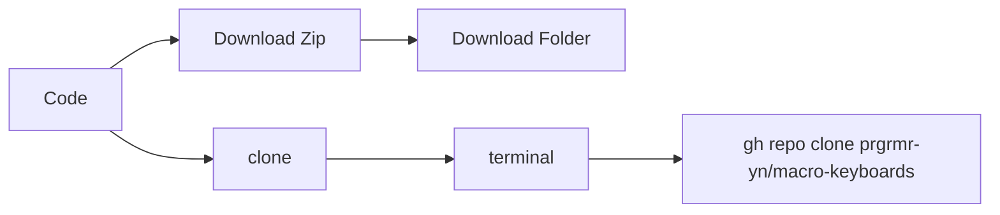

# Welcome to Sayo Macro Keyboard Guide!

Hi! I'm your **instructor**  and i will guide you on how to use this keyboard and tips and tricks

## Download or clone

# Youtube videos

I have made a bunch of youtube videos for you to visually understand the keyboard
Link:  [Youtube playlist](https://www.youtube.com/watch?v=Y-PFuFkAugc&list=PLYkiFc5F_qra9-jqyWB3uHS_9kTsK_j8U&pp=iAQB)

## Chapters on Playlist

1. **Device Setup**
2. **Getting familiar with interface**
3. **Modifiers on keys**
4. **Multiple key combination**
5. **Light modes**
6. **Key Triggers**
7. **Colors**
8. **Multimedia and mouse**

## This is my affiliate link if you interested to buy this keyboard

Link:  [ali express](https://s.click.aliexpress.com/e/_DE7c8gv)

## Channel name: **Macro Keyboardz**

I will soon be programming some templates and share the file so you can preinstall it

## Keys assigning is not the same in windows and mac

| Commands        |Mac                          |Windows                         |
|----------------|-------------------------------|-----------------------------|
| Copy			 | `Command + c`            	 |      `Ctrl + c`     		   |
|Paste           |`Command + v`           		 |`Ctrl + v`                   |
|Cut         	 |`Command + x`					 |`Ctrl + x`				   |

## Star this repository

If this video helped you in any way, give it a star ⭐️.

> ✨✨✨✨✨
